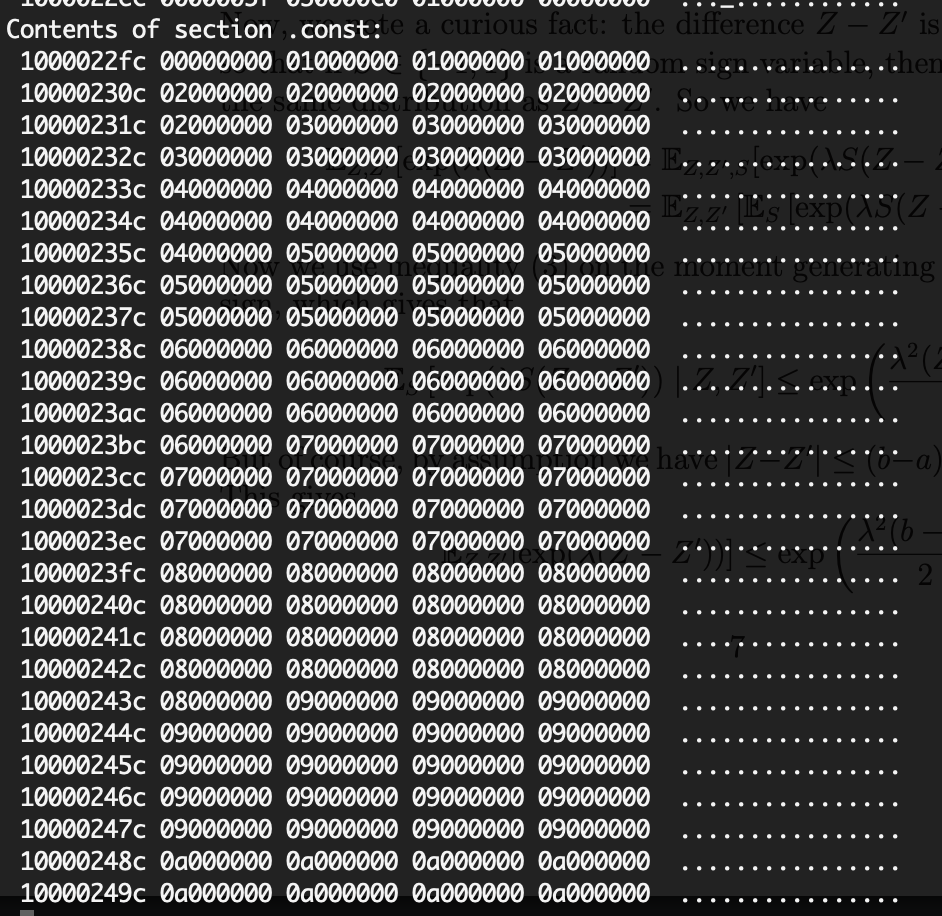

# templateMeta
My take at template ~~meta~~ programming.

## Array
Sample implementation of std::array

## Fast Sqrt
Compile time sqrt calculation using c++14 std.

RO Data now holds sqrt of numbers. 

## Fib numbers
Compile time fibonacci number calculation
